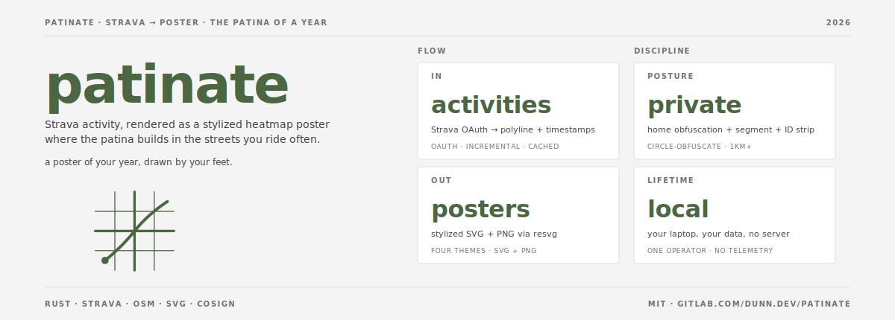
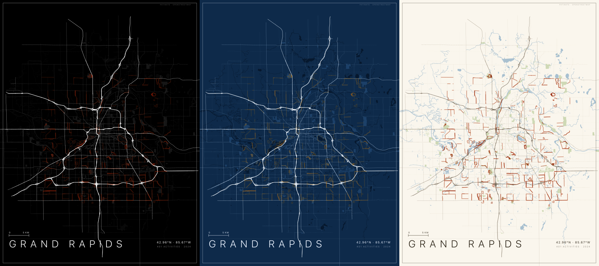
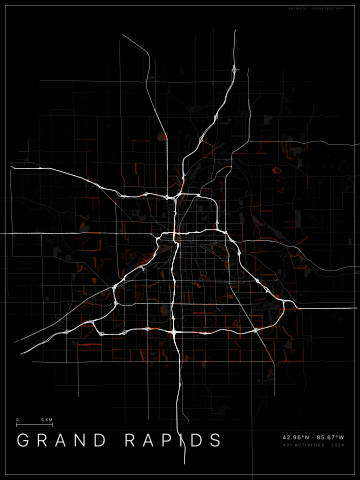
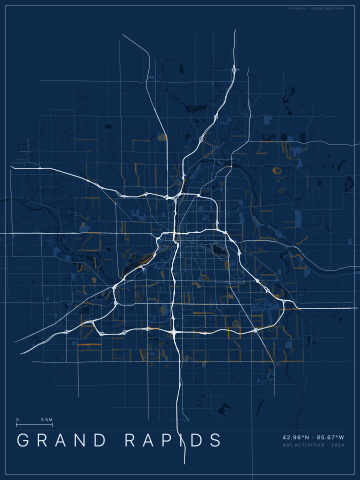
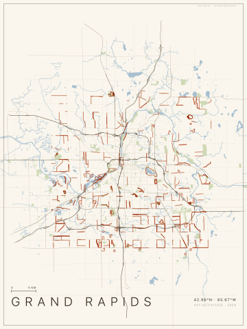
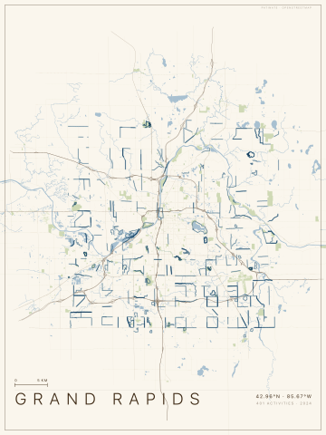

# patinate

[](https://gitlab.com/dunn.dev/patinate/-/pipelines)
[](LICENSE)


Render Strava activity into stylized heatmap posters and inline SVG.
The patina builds where you ride often: overlapping low-alpha strokes
accumulate into brighter color the way actual patina builds on metal.



The gallery above is the bundled `fixtures/activities.json`, sourced from
public Strava cycling and running segments for Grand Rapids. Athlete
IDs are zeroed, gear IDs are placeholders, segment names are generic
identifiers. The repo ships zero real-rider data and zero
maintainer-attributable coordinates.

## Quickstart

```bash
cargo install patinate
```

(Or `cargo install --git https://gitlab.com/dunn.dev/patinate` to
build from source.) Build needs a C compiler (`build-essential` /
`xcode-select --install`). No external runtime deps.

1. Register a Strava app at <https://www.strava.com/settings/api>.
   Authorization callback domain: `localhost`.

2. Write `~/.config/patinate/config.toml`:

   ```toml
   [general]
   city_name  = "Your City"
   country    = "USA"
   center_lat = 42.9634   # downtown
   center_lng = -85.6681
   radius_m   = 25000

   [render]
   theme          = "noir_heat"
   viewbox_width  = 1200
   viewbox_height = 1600

   [privacy]
   home_lat             = 42.9999  # YOUR home, not the map center
   home_lng             = -85.9999
   obfuscation_radius_m = 1000     # 1000m+ for anything you publish

   [strava]
   client_id     = "12345"
   client_secret = "your-strava-client-secret"
   ```

3. ```bash
   patinate auth                                                     # OAuth dance
   patinate fetch-osm --city "Your City, USA" --radius-m 25000       # OSM basemap
   patinate sync                                                     # pull activities
   patinate render --theme warm_beige --cycling --out heatmap.svg    # render
   ```

`patinate auth` writes the file at chmod 0600 (parent dir 0700) and
runs the `activity:read_all` OAuth scope. The dashboard's "Your Access
Token" is `read`-only and will not work for sync.

## Privacy

Real polyline-circle obfuscation. Every polyline is trimmed at the
home circle's edge before render; the inside-circle segment never
reaches the SVG. Activities entirely inside the circle are dropped.

Default-rendered SVGs embed `data-rider`, `data-bike`, `data-year`,
`data-type` on heat paths plus exact center coords in `<desc>`.
Useful for consumer-page filters; identifying in a public publication.

**For public publication, combine three things:**

```bash
patinate render --theme cycle_heat --anonymize --obfuscation-radius-m 1000 --out heatmap.svg
rsvg-convert -w 1200 heatmap.svg -o heatmap.png
```

Then publish the **PNG**. PNG carries no `data-*` attrs, no `<desc>`,
no machine-readable polyline geometry. Only what the eye sees
survives.

## Subcommands

| Command | What it does |
|---|---|
| `patinate auth` | OAuth with Strava. Tokens to `~/.config/patinate/config.toml`. |
| `patinate sync` | Incremental pull of activities into the SQLite cache. |
| `patinate fetch-osm` | OSM basemap for a city via Overpass. |
| `patinate render` | Heatmap SVG from cached activities + OSM. |
| `patinate list-themes` | Show embedded themes (and any in `--themes-dir`). |

## Themes

Four themes baked into the binary. `--themes-dir <dir>` adds custom
`*.json` themes alongside.

| Preview | Theme | Palette | Use when |
|---|---|---|---|
|  | `noir_heat` | Black background, white road hierarchy, hot orange heat. | Strava-classic, default poster. |
|  | `blueprint_heat` | Deep blueprint blue, cyan tracks. | Engineering-doc aesthetic. |
|  | `warm_beige` | Cream paper, sepia roads, terracotta heat. | Print output. |
|  | `cycle_heat` | Paper palette + steel-blue heat. | Inline web hero on a light page. |

<details>
<summary><strong>Render flag reference</strong></summary>

| Flag | Effect |
|---|---|
| `--theme <name>` | Theme to apply. Overrides `[render].theme`. |
| `--themes-dir <dir>` | Directory of custom `*.json` themes. |
| `--cycling` | Filter to `Ride` and `EBikeRide`. |
| `--type <list>` | Comma-separated activity types. |
| `--gear <id>` | Strava `gear_id` filter. Repeatable. |
| `--activity-id <n>` | Render a single activity by Strava ID. |
| `--min-distance-m <m>` | Drop sub-`m` noise stubs. Default `1000`. |
| `--web` | Single-layer heat, precision-1 coords, no typography, no minor roads. Inline-embed preset. |
| `--transparent-bg` | Skip the background rect. For inlining over a page background. |
| `--heat-only` | Skip basemap; render heat plus typography only. |
| `--anonymize` | Strip `data-*` from heat paths and scrub `<desc>`. Use for public publication. |
| `--obfuscation-radius-m <m>` | Override the privacy radius for one render. |
| `--heat-bloom <f>` | Multiplier on the glow stack. 0 = sharp, 1 = theme default, 2+ = soft cloud. |
| `--heat-alpha <f>` | Multiplier on sharp-core stroke opacity. |
| `--radius-m <m>` | Override the configured map radius. |
| `--viewbox-width <px>` / `--viewbox-height <px>` | Override viewBox dimensions. |
| `--no-refine` | Skip OSM filter pipeline. Diagnostic. |
| `--config <path>` | TOML config. Default `~/.config/patinate/config.toml`. |
| `--osm <path>` | Pre-fetched OSM JSON. Default per-user cache. |
| `--activities <path>` | JSON array of activities. Default: read from cache. |
| `--cache <path>` | SQLite cache path. Default per-user. |
| `--out <path>` | Output SVG. Default `heatmap.svg`. |

</details>

<details>
<summary><strong>Embed in a page</strong></summary>

The `cycle.dunn.dev` recipe: render once, rasterize to WebP, ship
the WebP. The consumer page provides its own typography (the `--web`
preset skips it).

```bash
patinate render --theme cycle_heat --cycling --web --transparent-bg \
  --radius-m 12000 --viewbox-width 1200 --viewbox-height 720 \
  --out hero.svg

rsvg-convert hero.svg -w 3600 -h 2160 -o /tmp/hero.png
magick /tmp/hero.png -quality 82 hero.webp
```

For inline SVG (hover behavior, JS filters, vector zoom), skip the
rasterize. Heat paths emit `data-rider` / `data-bike` / `data-year` /
`data-type` for consumer JS to wire up. **If the embedding page is
public, `--anonymize` first** — see "Privacy" above.

</details>

<details>
<summary><strong>Environment variables</strong></summary>

`PATINATE_OSM` is read by `patinate render` and **written** by
`patinate fetch-osm`. Pass `--out` explicitly if you want different
paths.

| Variable | Purpose |
|---|---|
| `STRAVA_PATINATE_CLIENT_SECRET` | OAuth client secret. |
| `STRAVA_PATINATE_REFRESH_TOKEN` | Long-lived refresh token. |
| `STRAVA_PATINATE_ACCESS_TOKEN` | Optional 24h access token. |
| `PATINATE_CONFIG` | TOML config path. |
| `PATINATE_OSM` | OSM JSON path (read by render, written by fetch-osm). |
| `PATINATE_THEMES_DIR` | Custom themes directory. |
| `PATINATE_OVERPASS_ENDPOINT` | Overpass API URL. |
| `PATINATE_CACHE` | SQLite cache path. |
| `PATINATE_ACTIVITIES` | Activity JSON path (skips the cache). |

Generic figment override: `PATINATE_<SECTION>__<KEY>`. Example:
`PATINATE_RENDER__VIEWBOX_WIDTH=1600`.

</details>

<details>
<summary><strong>Roadmap and known limitations</strong></summary>

- **Single-rider only.** Multi-rider rendering is deferred.
- **No built-in PNG.** Rasterize via `rsvg-convert`.
- **No JS interactivity layer.** `data-*` attrs are emitted; the
  markup is intentionally inert.
- **No tiled basemap.** Re-fetch OSM when you move or change radius.
- **No schema migrations.** Delete `~/.cache/patinate/cache.db` and
  re-sync after a version bump that changes the schema.
- **Sync is at-least-once on partial failure.** The watermark only
  advances after a full successful sweep; idempotent upserts cover it.
- **No antimeridian handling.** Cities within
  `radius_m / (111km * cos(lat))` of ±180° produce a degenerate frame.
- **No viewport culling.** OSM basemap renders in full regardless of
  `--radius-m`; rasterize for a tight file-size budget.
- **Strava rate limits:** 429 honors `Retry-After` once (60s cap).
- **Overpass rate limits:** 429/5xx bails immediately. Use
  `PATINATE_OVERPASS_ENDPOINT` for a private mirror.
- **No JSON-log conventions.** `tracing` keys are ad-hoc.
- **`--web` is a preset, not a separate renderer.** Drops typography,
  glow stack, and minor road tiers; trims coords. Pair with
  `--transparent-bg` for inline embeds.

</details>

<details>
<summary><strong>Architecture</strong></summary>

Rust binary, single static target. SQLite cache via `rusqlite`
(bundled). Figment for layered TOML and env config. `geo` for
polyline-circle clipping. `svg` crate for output. `oauth2` and
`reqwest` for the Strava dance. Overpass API for OSM basemap fetch.
`polyline` crate for decode. No JS runtime, no headless browser, no
external rasterizer at render time.

44 lib tests including a load-bearing privacy invariant test
(`apply_privacy_invariant_loop_through_home`) and an end-to-end SVG
validity test on synthetic input.

</details>

## Strava terms

Sync your own data. Do not redistribute Strava-derived raw activity
data. The rendered SVG is yours; the underlying GPS traces are not.
See <https://www.strava.com/legal/api>.

## Security

Privacy-bypass disclosures: see [SECURITY.md](SECURITY.md).
Contributing: see [CONTRIBUTING.md](CONTRIBUTING.md).

## License

MIT. See [LICENSE](LICENSE).

---

Built by Andrew G. Dunn.
